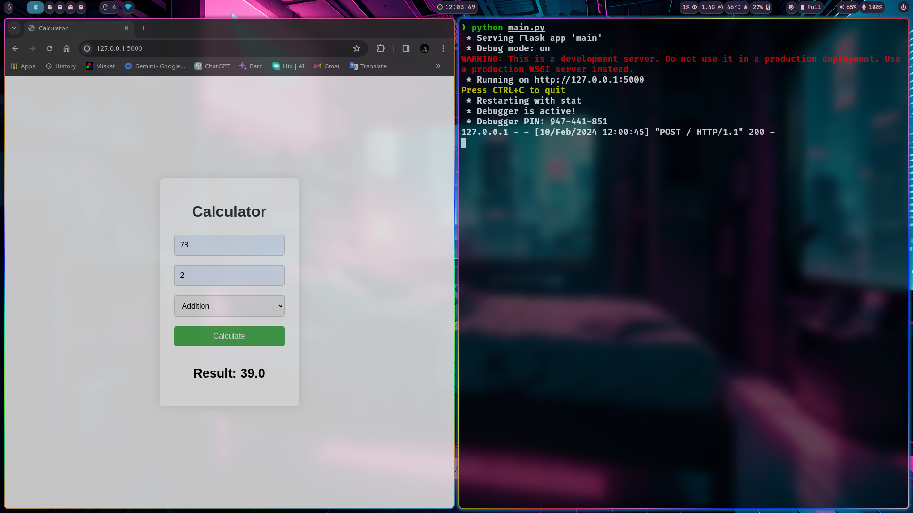

# WebBased-Calculator-App

A simple calculator app built with Flask, allowing users to perform basic arithmetic operations conveniently. Easy-to-use interface for quick calculations on the go.

Required libraries:
[x] Flask

Installation:

```Bash
#incase you have not installed Flask
pip install Flask
```

Following commands will run the app:

```Bash
#simply write the following command on bash, zsh, fish or powershell
python main.py
```


